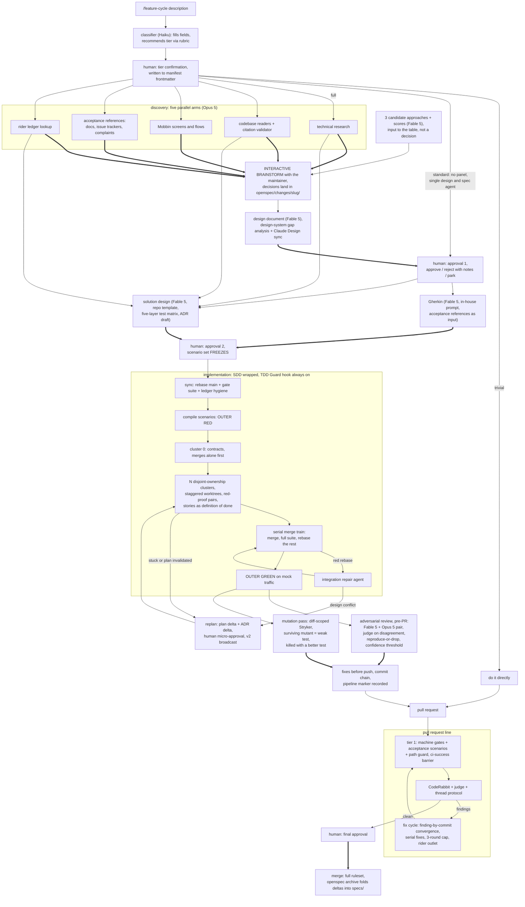

# Feature cycle: Design

Date: 2026-07-26
Status: Approved

## Context

The infrastructure queue is complete. The machine gates, the security baseline, Storybook, Playwright with a Gherkin acceptance layer, Chromatic, release operations, and a mutation gate all sit on `main`. Architecture Decision Records (ADR) 0020 through 0036 document them. Those gates judge every pull request after it exists. The process that produces the pull request still runs ad hoc. This spec locks the design of the **feature cycle**. The pipeline turns a feature idea into a merged pull request through a graph of subagent nodes, deterministic code nodes, and human gates.

Three hardening passes shaped the design. An adversarial critique panel of six independent reviewers confirmed 33 real gaps in the first draft, and the fixes below close them. Web research grounded every open point in documented practice. The maintainer approved each decision one by one.

## Decisions (user-locked)

- **OpenSpec owns the artifact layer.** `openspec/specs/` holds the living behavior contract for the whole system. Each feature lives in `openspec/changes/<slug>/` with proposal, design, tasks, and spec deltas, and archives into `specs/` on merge. A custom schema adds `discovery/`, `gherkin/`, and `manifest.md` to the change directory.
- **Superpowers drops to a library role.** The plugin no longer defines the process. The feature cycle calls it for the one part the community reports as expensive to replicate: the subagent-driven development executor and its resume ledger, plus the brainstorming question discipline.
- **The feature-cycle skill defines the process.** One entry point, `/feature-cycle <description>`, binds both layers. Human gates split the pipeline into separate workflow runs, and the interactive session orchestrates between them. Runs share no live state. Each run reads its inputs from the change directory and the manifest, and writes its outputs back. The artifacts on disk are the edges.
- **Gherkin generation stays in-house.** The maintainer found OpenSpec's generated scenarios below the project's bar. A dedicated node writes scenarios with the `gherkin-best-practices` skill and the collected acceptance references. OpenSpec only stores the result.
- **Tier selection is recommend-then-confirm.** A cheap classifier fills structured fields and recommends trivial, standard, or full through a written rubric. The maintainer confirms in one word. The pipeline allows mid-flight upgrades and forbids silent downgrades.
- **Implementation wraps subagent-driven development with parallel dispatch.** Contracts land first as a solo cluster. Only clusters with disjoint file ownership run in parallel, each in a staggered worktree. A serial merge train integrates them.
- **One heavy review pass runs before the pull request.** The adversarial review workflow replaces both the old pre-commit fan-out and any second automated pass at pull request time. CodeRabbit stays as the independent reviewer on the open pull request.
- **The model map is premium.** Fable 5 takes the judgment peaks, Opus 5 takes the worker nodes, and Haiku takes the mechanical leaves.
- **The Test-Driven Development (TDD) Guard hook is in scope.** Prompt-only test-first compliance measures near 40 percent in community reports, so an edit-time hook enforces the discipline at the editor boundary.

## Layer architecture

Three layers with distinct jobs, so no piece of knowledge lives twice.

- **OpenSpec (artifact lifecycle)**: change proposals, spec deltas, archive on merge, and validation. The `specs/` tree replaces dated design-doc archaeology with the current truth of how the system behaves, which shrinks the drift-audit surface.
- **Superpowers (execution library)**: the subagent-driven development executor, the git-ignored resume ledger, and the brainstorming discipline. Repo instructions override plugin instructions, which the plugin documents as the supported path.
- **Feature-cycle skill (process definition)**: the graph itself, the gate rules, the convergence rules, and the artifact contracts.

Prose gates treat the new tree the same way ADR-0030 treats plans. Machine-written `discovery/**` output is exempt through one glob per gate. Human-approved documents pass Vale and cspell in full. The existing `docs/superpowers/` specs and plans freeze as history, and no new documents land there.

## Planning phase

Planning runs as five parallel discovery arms, one interactive brainstorm, and two approval gates.

1. **Classify**: a Haiku classifier fills `isUI` and the affected subsystems, then recommends a tier with its rubric reasons. The maintainer confirms or overrides. The confirmed tier lands in `manifest.md` frontmatter.
2. **Discover** (parallel, capped at six subagents): technical research, codebase readers, Mobbin references, acceptance-criteria references, and a rider-ledger lookup. A zero-token citation validator rejects any code-map path or symbol that the repository lacks. The Mobbin arm runs only when the classifier marks `isUI`. Acceptance references come from vendor docs, issue trackers, and community complaints, because broken expectations reveal hidden criteria.
3. **Brainstorm** (interactive): three candidate approaches with scores arrive as table stakes, not as a decision. The maintainer and the session lock decisions together.
4. **Design document**: includes a design-system gap analysis and a Claude Design sync. Born Vale-compliant. **Approval gate 1.**
5. **Gherkin and solution design** (parallel, both consume the approved design): scenarios from the in-house prompt, and a solution design on the repo template with a filled five-layer test matrix (unit, integration, end-to-end, property, and mutation scope) and an ADR draft. The solution design also consumes the discovery outputs: the code map, the research findings, and the rider hits. **Approval gate 2.** The scenario set freezes here. Later changes go through a spec amendment and a fresh approval.

The list above describes the full tier. A confirmed trivial tier exits the pipeline: the session does the work directly, and the pull request still faces every machine gate. The standard tier skips the candidate panel and folds the five discovery arms into one research pass. A single subagent then writes the design and the solution design, and both approval gates stay unchanged.

Every human gate returns approve, reject with notes, or park. A rejection regenerates only the rejected artifact and keeps approved siblings frozen. The manifest records phase transitions only at gates, because fine-grained checklist writes drift.

## Implementation phase

Implementation wraps the subagent-driven development executor and adds the parallelization policy the gate-package history proved out. No feature-implement workflow script exists, by design. The phase runs through the superpowers executor under the skill's rules, which keeps the build surface small.

- A sync step rebases onto `main`, runs the local gate suite, and cleans stale resume-ledger entries before any work starts.
- The approved scenarios compile through playwright-bdd into a failing outer loop before the first cluster opens.
- The contracts cluster merges alone first, because the shared contract files are single collision points.
- Independent clusters run in parallel worktrees, created with a stagger to dodge the documented `git worktree add` race, each seeded by an environment setup script.
- Every task keeps a red-proof pair: the failing spec commit precedes the implementation commit, and no squash crosses that boundary.
- Property tests, end-to-end step definitions, and Storybook stories are explicit tasks, not implicit hopes. One task opens per invariant and per scenario, gated on the behavior or screen it exercises landing first. Unit and integration tests stay inside their TDD clusters. Stories count as the definition of done for renderer clusters.
- A serial merge train integrates clusters one at a time: merge, full suite, then every remaining worktree rebases and reruns. A repair subagent owns red rebases. Design conflicts escalate to a replan.
- Any cluster can raise a replan: a plan delta plus an ADR delta, a human micro-approval, and a version broadcast to the other clusters.
- The outer loop must go green on mock traffic before the phase ends.
- The TDD Guard hook watches every edit through the Vitest reporter and blocks implementation code that has no failing test behind it.

## Verification and pull request pipeline

Two passes run inside the worktree before the pull request opens, one judgment and one mutation, and deterministic gates stay the only merge blockers.

- **Adversarial review workflow**: a reviewer pair with deliberate model diversity, one Fable 5 and one Opus 5, because same-model panels amplify correlated errors. The two reviewers also take distinct lenses, so diversity covers angle as well as model. Disagreements escalate to a Fable 5 judge at maximum effort. Machine-checkable claims follow reproduce-or-drop. A confidence threshold filters the report, starting at the code-review plugin default of 80. Findings get fixed before the first push.
- **Process assertion**: a deterministic check confirms that two distinct reviewer subagents ran before the commit chain writes the pipeline marker, because orchestrators drift back to self-review.
- **Prohibition rules stay deterministic**: rules phrased as never-do-x live in gates and hooks, not in reviewer prompts, because reviewers miss negations.
- **Mutation pass**: the diff-scoped Stryker run executes in the worktree next to the review, because both consume the finished suite. A surviving mutant means a weak test, and the fix is a better test, not a lower threshold. The mutation gate on `main` (ADR-0036) stays the enforcing backstop.
- **Commit chain**: caveman-commit style, red-proof pairs preserved, and a pipeline marker recorded for the path guard.
- **Path guard** (deterministic, in continuous integration): a pull request that touches blast-radius paths without the pipeline marker triggers a demand for the heavy pass. Blast-radius paths are the Electron main and preload sources, the contracts package, storage, workflow definitions, and package manifests.
- **CodeRabbit**: unchanged, on every pull request, with the existing thread protocol.
- **Fix cycle**: a finding closes only when its own verifier confirms the fix on the new commit, keyed by finding and commit hash. Each round starts by rebasing onto `main` and rerunning the local gate suite. Fixes apply serially within a round. Behavior-level findings route back through a spec amendment with a fresh approval. Out-of-scope discoveries land in the rider ledger. Three rounds cap the cycle, and survivors go to human triage.
- **Acceptance in the gate tier**: the compiled acceptance scenarios run on the pull request next to the machine gates and the path guard.
- **Merge**: a human gives the final approval, and the pipeline never approves its own merge. The ruleset demands `ci-success`, the CodeRabbit review, the `codecov/patch` status, CodeQL, and resolved threads.

## Subagent roster and model map

Six subagent definitions live under `.claude/agents/`, named by workflow step with trigger-rule descriptions, `skills:` preloads, read-only tool sets for every judge, and project-scoped memory for reviewers.

| Subagent               | Access                     | Role                                                                         |
| ---------------------- | -------------------------- | ---------------------------------------------------------------------------- |
| `rules-reviewer`       | read-only                  | project-rule compliance (exists today)                                       |
| `code-analyzer`        | read-only                  | codebase maps for discovery                                                  |
| `researcher`           | web, no writes             | discovery arms and standalone research                                       |
| `tdd-implementer`      | full, worktree             | cluster implementation and merge-train repair, with preloaded testing skills |
| `adversarial-reviewer` | read-only                  | the review pair and the judge                                                |
| `design-critic`        | read-only plus screenshots | design-quality panels                                                        |

Model assignments: Fable 5 writes candidate approaches, design documents, Gherkin, and the hardest clusters, and it judges tiebreaks at maximum effort. Opus 5 runs research, semantic code reading at low effort, implementation, and mechanical verification. Haiku runs classification, triage, and file inventory, where a premium model buys only latency. Prompts bound for Fable 5 state goals and constraints instead of step lists. Every script pins hard subagent-count caps and tool-call budgets per phase.

## Rollout

Six pull requests, each in its own worktree with its own ADR where a gate or an adoption decision lands. The order follows dependency: the artifact layer lands before the process definition, and the process lands before the workflows that run it.

1. OpenSpec setup: initialization, the custom schema, and the prose-gate globs.
2. The feature-cycle skill, the subagent roster, the CLAUDE.md update, and the one-time solution-design template research.
3. The adversarial review workflow and the path guard.
4. The TDD Guard hook.
5. The feature-kickoff workflow script.
6. Fix-cycle automation, placed after the first live run so it encodes observed friction instead of guessed friction.

The provider hookup feature is the first live run of the full pipeline.

## Runtime graph

## Out of scope

Fix-cycle automation ships after the first live run. The standalone workflow backlog (renovate triage, health digest, design panel, upstream watch, release notes, flaky hunter) stays separate work. The scheduled instruction-drift audit, which checks CLAUDE.md, the skills, and the subagent definitions against reality, is also separate work. Engine-time riders keep their triggers.
